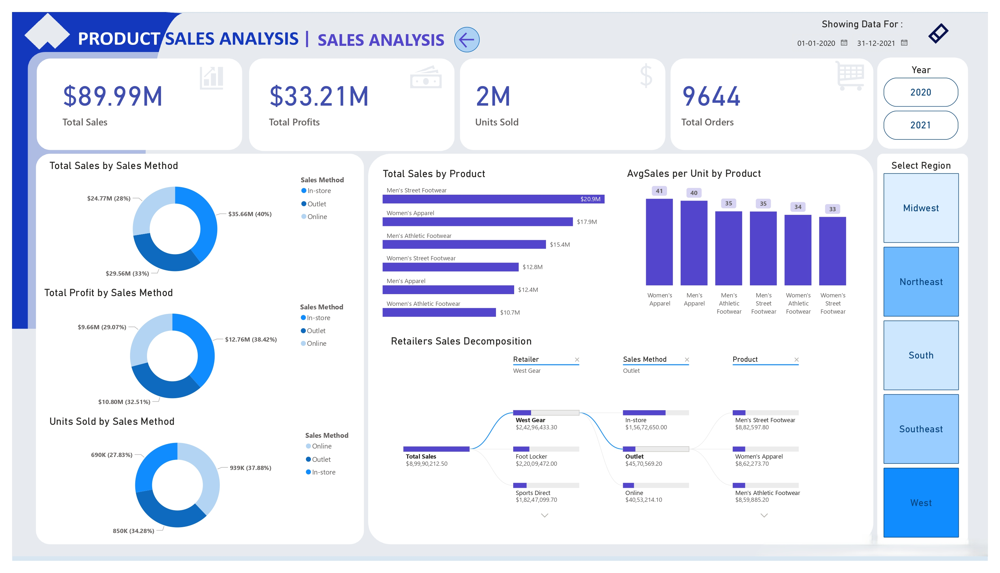

# 📦 Product Sales Analysis Dashboard

## 📌 Project Overview
This Power BI dashboard presents a full view of product sales from 2020–2021, analyzing sales distribution by state, region, quarter, product category, and sales method (in-store, online, outlet).

  

### **Objective:**  
To answer the question:  
**"How can a retail company optimize product, regional, and channel performance to increase sales and profitability?"**

### Key Business Questions Solved:
- Which products generate the highest sales and profits?
- What regions contribute the most to revenue?
- How do different sales methods (Online, Outlet, In-store) perform?
- What are the seasonal trends in sales?
- Which retailers bring in the most revenue?

---

## 🛠️ Tools & Technologies
- Power BI Desktop
- Data Sources: CSV/Excel (assumed)
- Measures and KPIs via DAX
- Time-based and cross-filtering enabled visuals

---

## 📈 Key Dashboard Features

1. 📊 Executive KPIs
   - Total Sales: $89.99M
   - Total Profits: $33.21M
   - Units Sold: 2M
   - Total Orders: 9,644

2. 🧭 Regional Analysis
   - Midwest leads with $24.86M (27.62%)
   - Northeast: $19.70M (21.89%)
   - West: $13.58M (15.09%)

3. 🛍️ Product Category Sales (Top Performers)
   - Men’s Street Footwear: $20.9M
   - Women’s Apparel: $17.9M
   - Men’s Athletic Footwear: $15.4M

4. 🌐 Sales by Channel
   - In-store: $35.66M (40%)
   - Outlet: $29.56M (33%)
   - Online: $24.77M (28%)

5. 📅 Time-Based Trends
   - Monthly breakdown of each product line
   - Seasonal trends & quarterly sales visualization

6. 🧩 Retailer Contribution
   - West Gear: $24.29M
   - Foot Locker: $22.00M
   - Sports Direct: $18.25M

---

## 💡 Insights

- **Men’s Street Footwear** is the **top-selling product** across all **months** and **channels**.
- **In-store sales dominate**, but **online** and **outlet sales** also show **strong contributions**.
- **Midwest region** consistently leads **sales contributions**, suggesting a **solid retail presence**.
- **Average sales per unit** is highest for **Women’s Apparel** and **Men’s Apparel** (*~$40/unit*).
- **Sales** and **profit margins** are **well-balanced** across different **product lines**.

---

## 📄 Dashboard

- **Sales Analysis**

  

---

